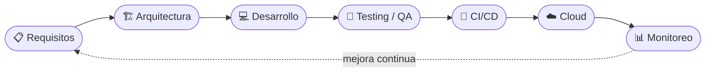
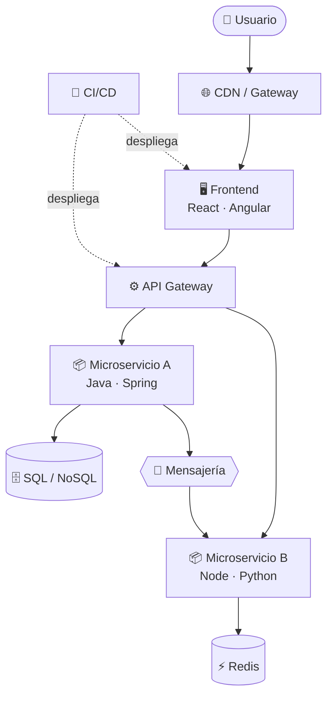

<div align="center">

<!-- HEADER ANIMADO -->


<!-- TYPING EFFECT -->
<a href="https://github.com/CristhoperSocalayR">
  
</a>

<br/>

<!-- BADGES SOCIALES -->
<p>
  <a href="https://linkedin.com/in/cristhopersocalay"></a>
  <a href="https://wa.me/51982316366"></a>
  <a href="mailto:cristhoper.socalay@ejemplo.com"></a>
  <a href="https://github.com/CristhoperSocalayR"></a>
</p>

<p>
  
  
  
</p>

<!-- NAVEGACIÓN -->
<p>
  <a href="#-whoami"><b>[ whoami ]</b></a> ·
  <a href="#-servicios"><b>[ servicios ]</b></a> ·
  <a href="#-stack-tecnológico"><b>[ stack ]</b></a> ·
  <a href="#-github-intelligence"><b>[ stats ]</b></a> ·
  <a href="#-proyectos-destacados"><b>[ proyectos ]</b></a> ·
  <a href="#-contáctame"><b>[ contacto ]</b></a>
</p>

</div>


## ⚡ `whoami`


```typescript
interface Developer {
  name:       "Cristhoper Socalay";
  location:   "Perú 🇵🇪";
  role:       "Full Stack Developer & Cloud Architect";
  education:  "Software Engineering";
  cloud:      ["AWS ☁️", "Azure 🔷", "GCP 🟡"];
  cms:        ["WordPress", "WooCommerce", "Elementor"];
  focus:      ["Microservices", "Cloud Native", "DevOps", "UX/UI"];
  currently:  "Architecting multi-cloud solutions";
  available:  true;
  coffee:     "☕ Critical dependency — always running";
}

const motto = (): string =>
  "Turning complex problems into elegant solutions.";
```

<br clear="right"/>

### 🖥️ Terminal

```bash
cristhoper@dev:~$ neofetch

   ██████╗ ███████╗      cristhoper@perú
  ██╔════╝ ██╔════╝      ─────────────────────────────
  ██║      ███████╗      OS ........ Linux / Cloud Native
  ██║      ╚════██║      Role ...... Full Stack & Cloud Architect
  ╚██████╗ ███████║      Cloud ..... AWS · Azure · GCP
   ╚═════╝ ╚══════╝      DevOps .... Docker · Kubernetes · CI/CD
                         Stack ..... React · Angular · Node · Java · Python
                         CMS ....... WordPress · WooCommerce
                         Shell ..... ☕ coffee --always-on

cristhoper@dev:~$ _
```

> *"El código limpio no es el que funciona; es el que otro desarrollador puede leer, entender y mejorar."*

### 🔄 Flujo de trabajo



### 🧩 Arquitectura de referencia




## 🎯 Servicios

<div align="center">

| ☁️ **Cloud & DevOps** | 🏗️ **Arquitectura & APIs** | 💻 **Desarrollo Web** | 🛒 **CMS & E-commerce** |
|:---:|:---:|:---:|:---:|
| Arquitectura AWS / Azure / GCP | Microservicios y APIs REST | Apps Full Stack a medida | WordPress avanzado |
| Contenedores Docker y Kubernetes | Integración entre sistemas | Frontend React / Angular | WooCommerce y pasarelas |
| Pipelines CI/CD | Diseño de bases de datos | Backend Java / Node / Python | Temas personalizados |
| Infraestructura y despliegues | Testing de APIs y rendimiento | Apps móviles Flutter | ACF Pro y REST API |

</div>


## 🧬 Stack Tecnológico

<div align="center">

### 🖥️ Frontend


### ⚙️ Backend


### 🗄️ Bases de Datos

<br/>


### ☁️ Cloud — AWS · Azure · GCP

<br/>


### 🔧 DevOps & CI/CD

<br/>


### 🌐 CMS — WordPress

<br/>


### 🧪 Testing · 📱 Mobile · 🛠️ Herramientas

<br/>


</div>


## 📊 GitHub Intelligence

<div align="center">
  
  
</div>

<div align="center">
  
</div>

### 🏆 Logros

<div align="center">
  
</div>

### 📈 Gráfico de Contribuciones


### 🐍 Snake — Mis commits devorando el calendario

<div align="center">
  <picture>
    <source media="(prefers-color-scheme: dark)" srcset="https://raw.githubusercontent.com/CristhoperSocalayR/CristhoperSocalayR/output/github-snake-dark.svg"/>
    
  </picture>
</div>

### 🟡 Pacman — Comiendo mis contribuciones

<div align="center">
  
</div>


## 🚀 Proyectos Destacados

<!-- Reemplaza "proyecto-ejemplo-N" por el nombre real de tus repositorios -->
<div align="center">
  <a href="https://github.com/CristhoperSocalayR/proyecto-ejemplo-1"></a>
  <a href="https://github.com/CristhoperSocalayR/proyecto-ejemplo-2"></a>
  <br/>
  <a href="https://github.com/CristhoperSocalayR/proyecto-ejemplo-3"></a>
  <a href="https://github.com/CristhoperSocalayR/proyecto-ejemplo-4"></a>
</div>


## 💡 Cita del día

<div align="center">
  
</div>


## 📡 Contáctame

<div align="center">

<a href="https://linkedin.com/in/cristhopersocalay"></a>
<a href="https://wa.me/51982316366"></a>
<br/>
<a href="mailto:cristhoper.socalay@ejemplo.com"></a>
<a href="https://github.com/CristhoperSocalayR"></a>

<br/><br/>

```
╔══════════════════════════════════════════════════════════════════╗
║  "El mejor código es el que aún no has escrito." ⚡              ║
║                              — Cristhoper Socalay                ║
╚══════════════════════════════════════════════════════════════════╝
```

</div>

<!-- FOOTER ANIMADO -->

